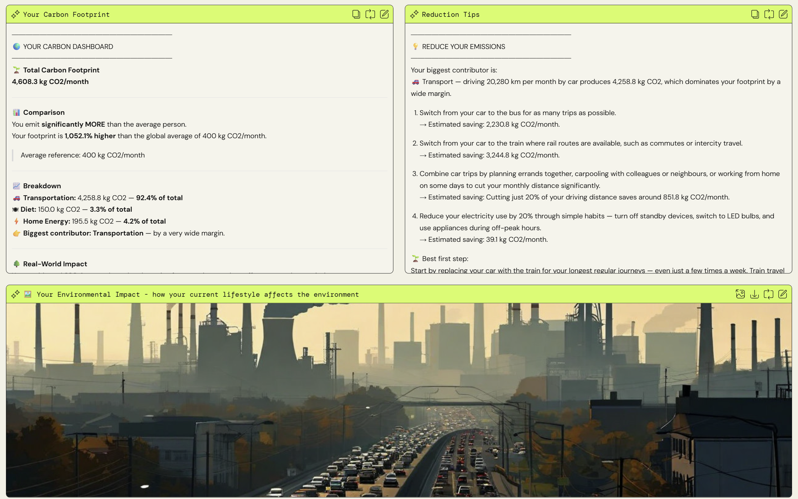
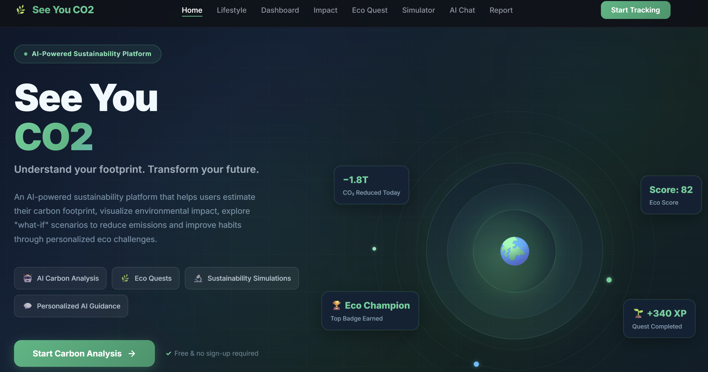

# 🌱 See You CO2

### Turning everyday habits into climate action.

🏆 **3rd Place Overall — AWS Cendekiawan 2026**  
🌍 **1st Place — Sustainability & Environment Domain**

See You CO2 is an AI-powered sustainability companion designed to help users understand, visualize, and reduce their carbon footprint through personalized AI insights, gamification, and environmental simulations.


## 🚨 Problem

Many sustainability tools today are:

- Too technical
- Too generic
- Disconnected from daily lifestyle habits

Users are often shown carbon numbers without understanding what actions to take next.

See You CO2 transforms carbon awareness into a more personalized, interactive, and actionable experience.


## ✨ Key Features

- 🌍 Carbon footprint calculator
- 📊 Emission breakdown dashboard
- 🤖 AI-powered sustainability chatbot
- 🎮 Gamified Eco Quest Mode
- 🔮 What-if lifestyle simulation
- 📄 Personalized sustainability report
- 🌱 Environmental impact visualization


## 📸 Preview

### Prototype 


### SeeYouCO2 Website



## 🧠 AI Integration

See You CO2 uses **Amazon Bedrock** with **Amazon Nova Lite** to generate:

- Personalized sustainability insights
- AI chatbot responses
- Eco missions and challenges
- Sustainability coaching
- Personalized sustainability reports

To improve reliability, carbon calculations are handled separately using deterministic rule-based logic in AWS Lambda.


## ☁️ AWS Architecture

```text
User Input
   ↓
Frontend (Kiro)
   ↓
API Gateway
   ↓
AWS Lambda
   ↓
Amazon Bedrock (Nova Lite)
   ↓
AI-generated sustainability response
   ↓
Frontend dashboard & chatbot
```

## AWS Services Used
- Amazon Bedrock — Generative AI responses
- Amazon Nova Lite — Lightweight AI model
- AWS Lambda — Backend processing and carbon calculation
- API Gateway — API routing
- S3 Bucket — Frontend hosting
- GitHub Actions — CI/CD deployment pipeline


## 🛠️ Technologies Used

### Frontend
- HTML
- CSS
- JavaScript
- Kiro

### Backend & Cloud
- AWS Lambda
- API Gateway
- Amazon Bedrock
- Amazon Nova Lite

### AI & Sustainability
- Prompt Engineering
- Carbon Emission Logic
- Gamification Design

## 🔮 Future Improvements

- User history tracking with DynamoDB
- Real-time sustainability analytics
- Bahasa Malaysia support
- Voice-based AI assistant
- Community eco challenges
- Mobile app version


## 🎥 Demo Video
[](https://www.youtube.com/watch?v=wWcaNTir1XI)


## 🔮 Future Improvements

- User history tracking with DynamoDB
- Real-time sustainability analytics
- Bahasa Malaysia support
- Voice-based AI assistant
- Community eco challenges
- Mobile app version

## 👥 Team Whoopie

Built during AWS Cendekiawan 2026.

Team Members:
- [@zafirahzunaidi]([https://github.com/zafirahzunaidi])
- [@ainadalilirafix]([https://github.com](https://github.com/ainadalilirafix))
- [@nurunnajihah]([https://github.com](https://github.com/nurunnajihah26))
- Nur Qistina
- Balqis Syawina

---

## Deployment

This project deploys automatically to AWS via GitHub Actions on push to `main`.

### AWS Resources Created
- **S3 Bucket** — hosts the frontend static site
- **Lambda Function** — handles API requests
- **API Gateway** — routes HTTP requests to Lambda

### Setup

1. Add these secrets to your GitHub repository (`Settings > Secrets and variables > Actions`):
   - `AWS_ACCESS_KEY_ID`
   - `AWS_SECRET_ACCESS_KEY`

2. Update the `AWS_REGION` in `.github/workflows/deploy.yml` if needed (default: `ap-southeast-1`).

3. Push to `main` to trigger deployment:
   ```bash
   git add .
   git commit -m "Restructure project for AWS deployment"
   git push origin main
   ```

## Local Development

### Frontend
Open `frontend/index.html` in a browser.

### Backend
```bash
cd backend/lambda
pip install -r requirements.txt
python -c "from app import lambda_handler; print(lambda_handler({'httpMethod':'GET','path':'/api/health'}, None))"
```

## API Endpoints

| Method | Path             | Description              |
|--------|------------------|--------------------------|
| GET    | /api/health      | Health check             |
| POST   | /api/calculate   | Calculate CO2 emissions  |
